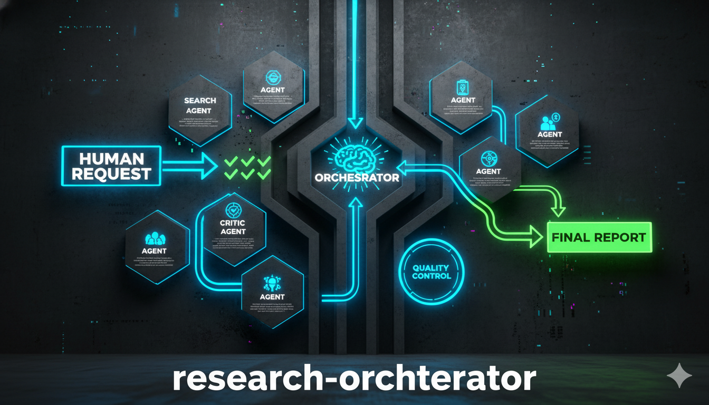

# Research Orchestrator



A two-phase multi-agent research system that uses Claude to autonomously plan and execute rigorous research with quality controls, citations, and confidence scoring.

## What Is This?

Research Orchestrator is a bash script that orchestrates Claude to conduct comprehensive research using a two-phase approach:

**Phase 1 (Planning)**: Claude Opus automatically creates:
- A research strategy tailored to your query
- Specialized research agents with custom prompts (saved as `agents.json`)
- An orchestration plan for execution

**Phase 2 (Execution)**: After you approve the plan, Claude coordinates specialized agents to:
- Research their assigned topics autonomously
- Include mandatory citations and confidence markers
- Cross-verify findings (in deep mode)
- Synthesize everything into a comprehensive analysis

## Key Features

- **Two-Phase Architecture**: Planning separated from execution for quality and user control
- **Approval Loop**: Review and refine research plans before execution
- **Specialized Agents**: Each agent gets a custom system prompt for focused expertise
- **Three Depth Modes**: Quick (~10min), Standard (~20min), Deep (~40min with verification)
- **Quality Controls**: Mandatory citations, confidence scoring (🟢🟡🔴), source verification
- **Focus Areas**: Optional targeting of specific research dimensions
- **Smart Folder Naming**: Automatic generation of descriptive folder names
- **Interactive & CLI Modes**: Guided setup or command-line automation

## Quick Start

```bash
# Clone the repo
git clone https://github.com/nguyenvanduocit/research-orchestrator
cd research-orchestrator

# Make executable
chmod +x ccheavy.sh

# Run interactively (recommended for first use)
./ccheavy.sh

# Or use command line
./ccheavy.sh "How does quantum computing work?"
```

## How It Works

### The Two-Phase Process

```
┌─────────────────────────────────────────────────────────────┐
│ PHASE 1: Strategic Planning (Automatic)                    │
├─────────────────────────────────────────────────────────────┤
│ • Claude Opus analyzes your query                          │
│ • Creates research strategy (research-plan.md)             │
│ • Defines specialized agents (agents.json)                 │
│ • Generates orchestration instructions                     │
│ • Takes ~30-60 seconds                                     │
└─────────────────────────────────────────────────────────────┘
                            ↓
┌─────────────────────────────────────────────────────────────┐
│ USER APPROVAL                                               │
├─────────────────────────────────────────────────────────────┤
│ • Review the research plan                                  │
│ • Provide feedback to refine (optional)                    │
│ • Approve to continue, or cancel                           │
└─────────────────────────────────────────────────────────────┘
                            ↓
┌─────────────────────────────────────────────────────────────┐
│ PHASE 2: Research Execution (After Approval)               │
├─────────────────────────────────────────────────────────────┤
│ • Specialized agents research their topics                  │
│ • Each agent includes citations & confidence markers       │
│ • Verification phase (deep mode only)                      │
│ • Final synthesis of all findings                          │
│ • Takes ~10-40 minutes depending on depth                  │
└─────────────────────────────────────────────────────────────┘
```

### What You Get

```
outputs/2025-11-10-your-research-topic/
├── research-plan.md              # The approved research strategy
├── agents.json                   # Specialized agent definitions
├── orchestration-prompt.md       # Instructions for Phase 2
├── assistants/
│   ├── ra-1-findings.md         # Agent 1 research (with citations)
│   ├── ra-2-findings.md         # Agent 2 research
│   ├── ra-N-findings.md         # Additional agents
│   └── ra-verification.md       # Verification report (deep mode)
└── final-analysis.md            # Comprehensive synthesis
```

## Installation

### Prerequisites

- **Claude Code CLI**: Install from https://claude.com/claude-code
- **Python 3**: For JSON validation (usually pre-installed on Mac/Linux)
- **Bash**: Unix-like environment (Mac/Linux/WSL)

### Setup

```bash
# Clone repository
git clone https://github.com/nguyenvanduocit/research-orchestrator
cd research-orchestrator

# Make script executable
chmod +x ccheavy.sh

# Test it
./ccheavy.sh "What is machine learning?"
```

That's it! The script creates the `outputs/` directory automatically.

## Usage

### Interactive Mode (Recommended)

```bash
./ccheavy.sh
```

You'll be prompted for:
1. **Research query** - What you want to research
2. **Depth** - quick/standard/deep (see depth comparison below)
3. **Focus areas** - Optional (e.g., "technology,economics,risks")
4. **Output format** - markdown (default) or text
5. **Dangerous mode** - Security flag (default: no)

Then:
6. **Review Phase 1 plan** - Claude Opus creates the research strategy
7. **Approve or refine** - Provide feedback to improve the plan, or approve as-is
8. **Phase 2 executes** - Specialized agents conduct research

### Command Line Mode

```bash
# Basic usage (standard depth)
./ccheavy.sh "What are the latest trends in renewable energy?"

# Quick research (~10 min)
./ccheavy.sh "Overview of Rust programming language" markdown --depth=quick

# Deep research with verification (~40 min)
./ccheavy.sh "Should we migrate to Kubernetes?" markdown --depth=deep

# Focused research on specific areas
./ccheavy.sh "Future of electric vehicles" markdown --depth=standard --focus=technology,economics,policy

# All options
./ccheavy.sh "AI safety research" markdown --depth=deep --focus=ethics,risks --dangerous
```

### Command Line Options

| Option | Values | Description |
|--------|--------|-------------|
| `--depth` | quick/standard/deep | Research depth (default: standard) |
| `--focus` | comma-separated | Target specific dimensions (optional) |
| `--dangerous` | flag | Skip permission checks (use with caution) |

### Depth Comparison

| Depth | Time | Agents | Words/Agent | Verification | Best For |
|-------|------|--------|-------------|--------------|----------|
| **quick** | ~10 min | 2-3 | 300-500 | ❌ | Quick overviews, initial scoping |
| **standard** | ~20 min | 4-6 | 500-1000 | ❌ | Comprehensive research (default) |
| **deep** | ~40 min | 6-8 | 1000-2000 | ✅ | Critical decisions, verification required |

## Research Quality Standards

Every research report includes:

### Mandatory Elements
- **Inline Citations**: `[descriptive text](https://source-url)` for every claim
- **Confidence Markers**:
  - 🟢 HIGH: Multiple independent sources, recent data
  - 🟡 MEDIUM: Single authoritative source, older but reliable
  - 🔴 LOW: Limited sources, uncertain, extrapolated
- **Source Diversity**: 3-5 different sources per major claim
- **Temporal Markers**: "As of [Month Year]" for time-sensitive data
- **Bibliography**: Complete sources list for each agent
- **Gaps Identification**: Explicit acknowledgment of limitations

### Final Analysis Includes
- Executive summary
- Research methodology (agents used, sources reviewed)
- Confidence distribution (% of claims at each level)
- Detailed findings organized by themes
- Cross-cutting insights
- Limitations and gaps
- Areas of uncertainty
- Complete deduplicated bibliography

## Examples

See the `examples/` directory for complete research outputs:

**Austin's 5-Year Outlook**
- Query: "What does the outlook for the next 5 years look like for Austin, TX?"
- 6 agents, ~11,500 words, comprehensive analysis of economy, tech, infrastructure

**AI's Impact on Healthcare**
- Query: "How will AI impact healthcare?"
- 5 agents covering diagnostics, drug discovery, patient care, ethics, implementation

## The Approval & Feedback Loop

After Phase 1 planning, you can:

- ✅ **Approve**: Press Enter or type "yes" to proceed with research
- ✗ **Cancel**: Type "no" to stop
- ✎ **Refine**: Provide feedback to improve the plan

**Example feedback:**
- "Focus more on costs and risks"
- "Add an agent for security analysis"
- "Make it more technical"
- "I need this for a business decision, go deeper"

Claude Opus will regenerate the plan incorporating your feedback, and you can review again. This loop continues until you approve or cancel.

## Advanced Features

### Agent Definitions (agents.json)

Phase 1 creates specialized agents with custom system prompts. Example:

```json
{
  "ra-1-architecture-expert": {
    "description": "Analyzes core architectural differences",
    "prompt": "You are an Architecture Expert specializing in...\n\n[custom prompt with expertise, quality standards, search strategy]"
  },
  "ra-2-performance-analyst": {
    "description": "Evaluates performance and benchmarks",
    "prompt": "You are a Performance Analyst...\n\n[custom prompt]"
  }
}
```

Each agent:
- Gets a custom system prompt tailored to their expertise
- Has full tool access (WebSearch, Read, Write, etc.)
- Operates with proper isolation
- Includes embedded quality standards
- Has suggested search strategies

### Focus Areas

Target specific aspects while maintaining comprehensive coverage:

```bash
./ccheavy.sh "Future of blockchain" --focus=scalability,energy,regulation
```

The research plan will emphasize these areas without excluding other important perspectives.

### Verification Mode

Deep research automatically includes a verification agent that:
- Reads all other agents' findings
- Cross-checks key statistical claims
- Identifies contradictions between sources
- Validates benchmark claims
- Flags single-source claims needing more verification
- Checks for bias or missing perspectives

## When to Use Each Depth

### Quick Mode (~10 min)
**Use when:**
- You need a quick overview
- Initial feasibility assessment
- Basic technology comparison
- Preliminary understanding

**Examples:**
- "What is WebAssembly?"
- "Quick comparison: React vs Vue"
- "Latest DevOps trends"

### Standard Mode (~20 min, Default)
**Use when:**
- Comprehensive research needed
- Multi-dimensional analysis
- Informed decision-making
- Deep topic understanding

**Examples:**
- "Should we migrate from MongoDB to PostgreSQL?"
- "How will AI impact healthcare?"
- "5-year outlook for Austin, TX"

### Deep Mode (~40 min)
**Use when:**
- Critical business decisions
- High-stakes analysis
- Cross-verified facts required
- Comprehensive due diligence

**Examples:**
- "Evaluate acquiring Company X for $10M"
- "Should we rewrite our platform in Rust?"
- "Comprehensive security audit of our architecture"

## Why This Approach?

### Two-Phase Architecture Benefits
- **Quality Control**: Separate planning from execution prevents rushed decisions
- **User Oversight**: Review strategy before committing time and resources
- **Iterative Refinement**: Provide feedback to improve research direction
- **Transparent Process**: See exactly how research will be conducted

### Specialized Agents vs Generic Research
- **Better Focus**: Each agent has a specific expertise domain
- **Deeper Analysis**: Custom prompts guide agents to ask the right questions
- **Quality Standards**: Embedded in each agent's prompt
- **Parallel Execution**: Agents can work simultaneously
- **Reproducible**: Agent definitions are saved and reusable

### Quality Over Speed
- **Citations Required**: No unsupported claims
- **Confidence Markers**: Understand reliability of each finding
- **Source Diversity**: Multiple perspectives, not single sources
- **Gap Acknowledgment**: Honest about research limitations
- **Verification**: Cross-checking in deep mode

## Configuration

The script automatically configures based on depth:

**Quick**:
- 2-3 assistants
- 300-500 words per assistant
- No verification phase
- Haiku model recommended

**Standard** (default):
- 4-6 assistants
- 500-1000 words per assistant
- No verification phase
- Sonnet model recommended

**Deep**:
- 6-8 assistants
- 1000-2000 words per assistant
- Verification phase required
- Opus for planning, Sonnet for research

Claude autonomously determines:
- Exact assistant count within recommended range
- Specific research questions
- Specialized roles and perspectives
- Search strategies for each agent

## Troubleshooting

### "Command not found: claude"
Install Claude Code CLI:
```bash
# Follow instructions at:
https://claude.com/claude-code
```

### Research seems slow
- Normal for standard research: ~20 minutes
- Deep research can take up to 40 minutes
- Time varies based on query complexity and web search speed
- Quick mode available if you need faster results

### Invalid JSON in agents.json
- Phase 1 validation should catch this automatically
- The script uses Python to validate JSON before proceeding
- If you see this error, it indicates a Phase 1 failure
- Check `.phase1-output.log` for details

### Phase 1 planning failed
- Check `$OUTPUT_DIR/.phase1-output.log` for error details
- Ensure Claude Code CLI is working: `claude --version`
- Verify you have internet connection for Claude API
- Try running with a simpler query first

## Architecture Notes

### What's Different from Original claude-code-heavy?

This fork differs significantly:
- **No Git Worktrees**: Simpler directory structure
- **Two-Phase Process**: Explicit separation of planning and execution
- **User Approval Loop**: Review plans before execution
- **Smart Folder Naming**: Uses Haiku to generate descriptive names
- **Agent Definitions**: JSON-based agent configuration
- **Updated Quality Standards**: Enhanced citation and confidence requirements

### Why No Worktrees?

The original used git worktrees for agent isolation. This implementation:
- Uses Claude Code's native agent orchestration instead
- Simpler setup (no git worktree commands)
- Faster execution (no git overhead)
- Easier to understand and modify
- Same quality results with less complexity

## Contributing

This is a personal fork with different architectural opinions. For contributions:

1. Fork this repository
2. Create a feature branch
3. Test with various query types and depths
4. Submit a pull request

For the original project, see [claude-code-heavy](https://github.com/gtrusler/claude-code-heavy).

## License

MIT License

See [LICENSE](LICENSE) file for details.

## Credits

This project is forked from [claude-code-heavy](https://github.com/gtrusler/claude-code-heavy) by [Graydon Trusler](https://github.com/gtrusler).

**Why a separate repository?**

While the original project provides an excellent foundation, I created this fork because my workflow, development approach, and opinions on the architecture differ significantly from the author's vision. This independent repository allows me to:

- Experiment with different architectural patterns (two-phase vs single-phase)
- Implement features aligned with my specific use cases (approval loops, agent definitions)
- Maintain a workflow that suits my development preferences (no worktrees, JSON agents)
- Make breaking changes without affecting the upstream project

I'm grateful to Graydon for creating the original framework and making it open source. If you prefer the original implementation or want to contribute to the main project, please visit the [original repository](https://github.com/gtrusler/claude-code-heavy).

## Acknowledgments

- Original project: [claude-code-heavy](https://github.com/gtrusler/claude-code-heavy) by Graydon Trusler
- Inspired by [make-it-heavy](https://github.com/Doriandarko/make-it-heavy) by Pietro Schirano
- Built on [Claude Code](https://claude.com/claude-code) by Anthropic

---

**Ready to conduct rigorous research?**

```bash
./ccheavy.sh "Your research question here"
```
