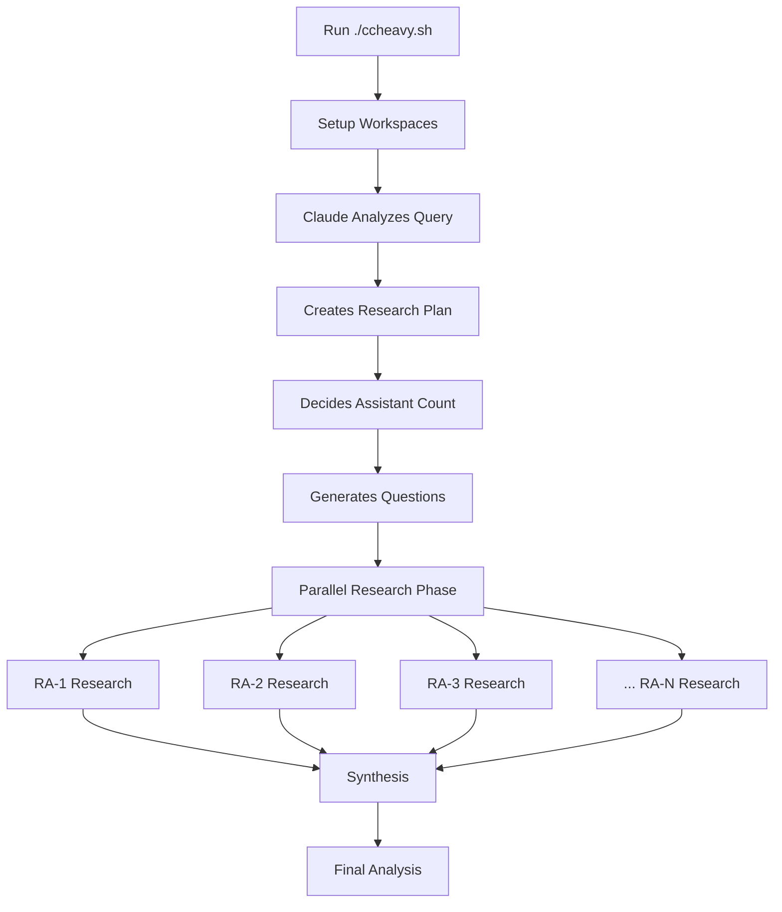

# Claude Code Heavy v2.0

A powerful multi-agent research system with **quality controls**, **verification**, and **flexible depth settings**. Delivers rigorous, well-cited research with confidence scoring and cross-verification.

## 🆕 What's New in v2.0

- ✨ **Quality Controls**: Mandatory citations, confidence scoring (🟢🟡🔴), source verification
- 📊 **Research Depth Modes**: Quick (~10min), Standard (~20min), Deep (~40min with verification)
- ✅ **Verification Phase**: Deep mode includes cross-checking and contradiction detection
- 🎯 **Focus Areas**: Optional targeting of specific research dimensions
- 🏗️ **Simplified Architecture**: Removed git worktrees - cleaner, faster setup
- 📚 **Enhanced Quality**: 3-5 sources per claim, explicit confidence levels, gap identification
- 📝 **Task Tracking**: Integrated TodoWrite for progress visibility

## 🚀 What is Claude Code Heavy?

Claude Code Heavy gives Claude full control to orchestrate rigorous parallel research:
- 🧠 **Intelligent Planning**: Claude analyzes your query and creates optimal research strategy
- 🔀 **Parallel Research**: Claude decides assistant count and deploys them efficiently (2-8 available)
- 🎯 **Dynamic Adaptation**: Questions and roles tailored to your specific query
- ✅ **Quality Assurance**: Mandatory citations, confidence scoring, verification (deep mode)
- 🔄 **Smart Synthesis**: Claude combines all findings with proper attribution
- 🚙 **Interactive Mode**: Simple setup with powerful results
- 📊 **Depth Control**: Choose quick/standard/deep based on research criticality

## 🎯 Quick Start

```bash
# Clone the repo
git clone https://github.com/gtrusler/claude-code-heavy
cd claude-code-heavy

# Make script executable
chmod +x ccheavy.sh

# Run interactively (recommended) - now with depth and focus controls!
./ccheavy.sh

# Or use command line with new options
./ccheavy.sh "How do we solve the global water supply issue?"

# Quick research (10 mins)
./ccheavy.sh "Latest trends in AI" markdown --depth=quick

# Deep research with verification (40 mins)
./ccheavy.sh "Should we migrate to Kubernetes?" markdown --depth=deep

# Focused research on specific areas
./ccheavy.sh "Future of renewable energy" markdown --focus=technology,economics,policy
```

## 🤔 Why This Approach?

**Claude is the Intelligence**: Instead of hard-coding research patterns, we let Claude:
- Analyze your query and determine the best approach
- Decide how many research assistants are needed (2-8)
- Create specific, targeted research questions
- Adapt the research strategy in real-time
- **NEW**: Apply quality controls (citations, confidence scoring)
- **NEW**: Cross-verify claims in deep mode

**Quality-First Design**: v2.0 adds rigorous research standards:
- **Mandatory Citations**: Every claim links to source URL
- **Confidence Scoring**: 🟢 HIGH, 🟡 MEDIUM, 🔴 LOW for all key findings
- **Source Diversity**: 3-5 independent sources per major claim
- **Verification Phase**: Deep mode includes cross-checking assistant
- **Gap Identification**: Explicit acknowledgment of research limitations

**Flexible Depth Control**: Choose the right level for your needs:
- **Quick** (~10 min): 2-3 assistants, 300-500 words each - perfect for quick overviews
- **Standard** (~20 min): 4-6 assistants, 500-1000 words - comprehensive research
- **Deep** (~40 min): 6-8 assistants, 1000-2000 words + verification - critical decisions

## 📖 How It Works



### Process Flow

1. **You provide a query**: Any research question or topic
2. **Script prepares environment**: Creates 8 workspaces, output directories
3. **Claude takes over**:
   - Analyzes complexity and scope
   - Plans optimal research strategy
   - Creates targeted questions
   - Orchestrates parallel execution
   - Synthesizes comprehensive results

## 🛠️ Installation

### Prerequisites
- Claude Code installed (`npm install -g @anthropic-ai/claude-code`)
- Claude Pro or Teams subscription (strongly recommended for best performance)
- Git with worktree support (git 2.7+)
- Unix-like environment (Mac/Linux/WSL)

### Setup
```bash
# Clone and setup
git clone https://github.com/gtrusler/claude-code-heavy
cd claude-code-heavy
./setup.sh
```

## 🎮 Usage

### Interactive Mode (Recommended)
```bash
./ccheavy.sh
# Enhanced prompts guide you through:
# 1. Research question - What you want to research
# 2. Depth - quick/standard/deep (with time estimates)
# 3. Focus areas - Optional targeting (e.g., "technology,economics,risks")
# 4. Output format - markdown (default) or text
# 5. Dangerous mode - Security flag (default: N)
# 6. Confirmation - Review settings before starting
# 7. Auto-launch - Optionally launch Claude Code immediately
```

### Command Line Mode
```bash
# Basic usage (standard depth, ~20 min)
./ccheavy.sh "What are the latest advances in quantum computing?"

# Quick research (~10 min)
./ccheavy.sh "Latest trends in AI" markdown --depth=quick

# Deep research with verification (~40 min)
./ccheavy.sh "Should we adopt microservices?" markdown --depth=deep

# Focused research on specific areas
./ccheavy.sh "Blockchain technology" markdown --focus=security,scalability,energy

# All options combined
./ccheavy.sh "Cloud migration strategy" markdown --depth=deep --focus=costs,risks,timeline --dangerous
```

### Command Line Options

| Option | Values | Description |
|--------|--------|-------------|
| `--depth` | quick/standard/deep | Research depth (default: standard) |
| `--focus` | comma-separated areas | Target specific dimensions |
| `--dangerous` | flag | Skip permission checks (use with caution) |

### Depth Comparison

| Depth | Time | Assistants | Words/Assistant | Verification | Best For |
|-------|------|------------|-----------------|--------------|----------|
| **quick** | ~10 min | 2-3 | 300-500 | ❌ | Quick overviews, initial scoping |
| **standard** | ~20 min | 4-6 | 500-1000 | ❌ | Comprehensive research (default) |
| **deep** | ~40 min | 6-8 | 1000-2000 | ✅ | Critical decisions, high-stakes analysis |
```

### Output Structure
```
outputs/
└── 2025-11-10-solve-global-water-crisis/
    ├── orchestration-prompt.md    # Enhanced prompt with quality standards
    ├── research-plan.md          # Claude's research strategy
    ├── assistants/
    │   ├── ra-1-findings.md      # Assistant 1 (with citations & confidence)
    │   ├── ra-2-findings.md      # Assistant 2 (with citations & confidence)
    │   ├── ra-N-findings.md      # Additional assistants
    │   └── ra-verification.md    # Verification report (deep mode only)
    └── final-analysis.md         # Synthesized results with bibliography
```

### Quality Standards in Every Report

Each assistant's findings now include:
- **Inline Citations**: `[descriptive text](https://source-url)` for every claim
- **Confidence Markers**: 🟢 HIGH, 🟡 MEDIUM, 🔴 LOW for key findings
- **Sources Section**: Complete bibliography with access dates
- **Confidence Assessment**: Counts of high/medium/low confidence claims
- **Gaps & Limitations**: Explicit acknowledgment of research boundaries

Final analysis includes:
- **Research Methodology**: Assistants used, sources reviewed, confidence distribution
- **Complete Bibliography**: All sources from all assistants, deduplicated
- **Limitations & Gaps**: Identified weaknesses in available research
- **Areas of Uncertainty**: Claims marked with low confidence or conflicts

## 📋 Example Outputs

See the `examples/` directory for complete research outputs:

### 1. Austin's 5-Year Outlook
- **Query**: "What does the outlook for the next 5 years look like for Austin, TX?"
- **Assistants**: 6 (Claude's decision based on complexity)
- **Total Output**: ~11,500 words
- **Key Insights**: Economic growth, tech hub evolution, infrastructure challenges

### 2. AI's Impact on Healthcare  
- **Query**: "How will AI impact healthcare?"
- **Assistants**: 5 (covering different healthcare domains)
- **Focus Areas**: Diagnostics, drug discovery, patient care, ethics, implementation
- **Comprehensive analysis** of transformation across the industry

Quick examples of queries Claude handles well:

- **Scientific**: "How do mRNA vaccines work?"
- **Business**: "Analyze the electric vehicle market"
- **Policy**: "Evaluate universal basic income proposals"
- **Technical**: "Compare Rust vs Go for systems programming"
- **Historical**: "What led to the fall of the Roman Empire?"
- **Local**: "What's the 5-year outlook for Austin, TX?"

## 💡 When to Use Each Depth Mode

### Quick Mode (~10 min)
**Use when you need:**
- Quick market overview
- Initial feasibility assessment
- Basic technology comparison
- Preliminary understanding of a topic

**Example queries:**
- "What is WebAssembly?"
- "Quick comparison: React vs Vue"
- "Latest trends in DevOps"

### Standard Mode (~20 min, Default)
**Use when you need:**
- Comprehensive research
- Multi-dimensional analysis
- Informed decision-making
- Deep understanding of a topic

**Example queries:**
- "Should we migrate from MongoDB to PostgreSQL?"
- "How will AI impact healthcare?"
- "5-year outlook for Austin, TX"

### Deep Mode (~40 min)
**Use when you need:**
- Critical business decisions
- High-stakes analysis
- Cross-verified facts
- Comprehensive due diligence

**Example queries:**
- "Evaluate acquiring Company X for $10M"
- "Should we rewrite our platform in Rust?"
- "Comprehensive security audit of our architecture"

## 🔧 Configuration

The script handles configuration automatically based on depth:
- **Quick**: 2-3 assistants, 300-500 words, no verification
- **Standard**: 4-6 assistants, 500-1000 words, no verification
- **Deep**: 6-8 assistants, 1000-2000 words, **verification required**

Claude autonomously:
- Determines exact assistant count within range
- Creates focused research questions
- Assigns specialized roles and perspectives
- Applies quality controls and citations
- Cross-verifies claims (deep mode)

## 🚀 Advanced Features

### Security Options
- Option to use `--dangerously-skip-permissions` flag
- Default is secure mode (recommended)
- Only enable for trusted research tasks

### Parallel Execution
- Claude orchestrates parallel tool calls
- Multiple web searches execute simultaneously
- Faster research completion

### Smart Folder Naming
- Queries converted to readable folder names automatically
- Date prefixing for easy chronological sorting
- Example: "How will AI impact health care?" → `2025-07-18-how-will-ai-impact-health-care`

## 🏗️ Architecture

### Why Git Worktrees?
- Each assistant gets isolated workspace
- Parallel execution without conflicts
- Easy context switching for Claude
- Git tracks all research history

### Why Let Claude Decide?
- Every query is unique
- Claude understands context better
- Dynamic adaptation beats static patterns
- Optimal resource allocation

## 🐛 Troubleshooting

### "Command not found: claude"
Make sure Claude Code is installed: `npm install -g @anthropic-ai/claude-code`

### "Git worktree error"
```bash
# Update git
brew upgrade git  # Mac
sudo apt-get update && sudo apt-get upgrade git  # Linux
```

### Research seems slow
- Normal research takes 5-10 minutes
- Complex queries may take up to 15-20 minutes
- Check if web searches are working

## 🤝 Contributing

1. Fork the repository
2. Create your feature branch
3. Test with various query types
4. Submit a pull request

## 📄 License

MIT License with Commercial Attribution Requirement

**For products with 100K+ users**: Please include attribution to Graydon Trusler and mention the "Claude Code Heavy" framework in your documentation or credits.

See [LICENSE](LICENSE) file for full details.

## 🙏 Acknowledgments

- Inspired by [make-it-heavy](https://github.com/Doriandarko/make-it-heavy) by Pietro Schirano
- Inspired by Grok Heavy mode
- Built on Claude Code by Anthropic
